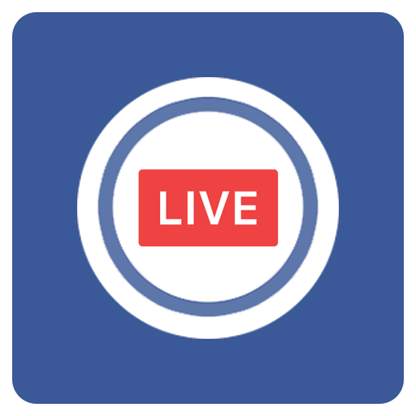
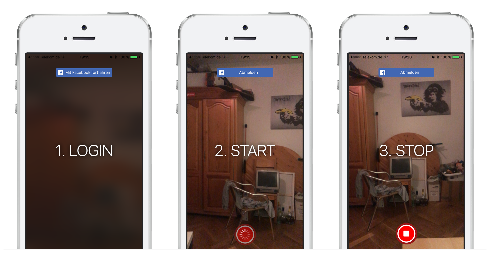

# &nbsp;Facebook Live iOS
A custom Swift utility "FBSDKLiveVideo" to stream Facebook Live videos on iOS.



## Example
The following example would create a full-screen live video preview that is started when the user taps
the trigger button linked in your Storyboard.

```swift 
class ViewController: UIViewController {
    
    var liveVideo: FBSDKLiveVideo!

    override func viewDidLoad() {
        super.viewDidLoad()
      
        // Create the live video service
        liveVideo = FBSDKLiveVideo(
            delegate: self,
            previewSize: self.view.bounds,
            videoSize: CGSize(width: 1280, height: 720)
        )
        
        // Optional: Configure the live-video (see the source for all options)
        liveVideo.privacy = .me // or .friends, .friendsOfFriends, .custom
        liveVideo.audience = "me" // or your user-id, page-id, event-id, group-id, ...
        
        // Optional: Add the preview view of the stream to your container view.
        myView.addSubView(liveVideo.preview)
    }
    
    @IBAction func recordButtonTapped() {
        liveVideo.start()
    }    

    @IBAction func stopButtonTapped() {
        liveVideo.stop();
    }

    @IBAction func adBreakButtonTapped() {
        liveVideo.adBreakStartNow = true
        liveVido.update();
    }

    @IBAction func deleteButtonTapped() {
        liveVido.delete();
    }
}

extension ViewController: FBSDKLiveVideoDelegate {
    func liveVideo(_ liveVideo: FBSDKLiveVideo, didStartWith session: FBSDKLiveVideoSession) {
        // Live video started
    }

    func liveVideo(_ liveVideo: FBSDKLiveVideo, didStopWith session: FBSDKLiveVideoSession) {
        // Live video ended
    }

    func liveVideo(_ liveVideo: FBSDKLiveVideo, didErrorWith: Error) {
        // Live video errored
    }

    func liveVideo(_ liveVideo: FBSDKLiveVideo, didChange sessionState: FBSDKLiveVideoSessionState) {
        // Live video changed session state
        // One of: .none, .previewStarted, .starting, .started, .ended, .error
    }

    func liveVideo(_ liveVideo: FBSDKLiveVideo, didAdd cameraSource: FBSDKLiveVideoSession) {
        // New camera source added to the stream
    }

    func liveVideo(_ liveVideo: FBSDKLiveVideo, didUpdate session: FBSDKLiveVideoSession) {
        // Live video was updated through update()
    }

    func liveVideo(_ liveVideo: FBSDKLiveVideo, didDelete session: FBSDKLiveVideoSession) {
        // Live video was deleted through delete()
    }
}
```

## Build
* Run `pod install` to install the required dependencies (Facebook SDK + VideoCore)
* Open the `facebook-live-ios-sample.xcworkspace` file in Xcode
* Change the app-id inside the `Info.plist` to match your app. Ensure to configure the App-ID correctly
* Run the project on your iOS device! By default, it will only start a live-stream to your private audience ("Only me")

## License
MIT - Try it out, modify it, use it!

## Author
Hans Knöchel ([@hansemannnn](https://twitter.com/hansemannnn))

## Contributions
Code contributions are greatly appreciated, please submit a new [Pull Request](https://github.com/hansemannn/facebook-live-ios/pull/new/master)!
